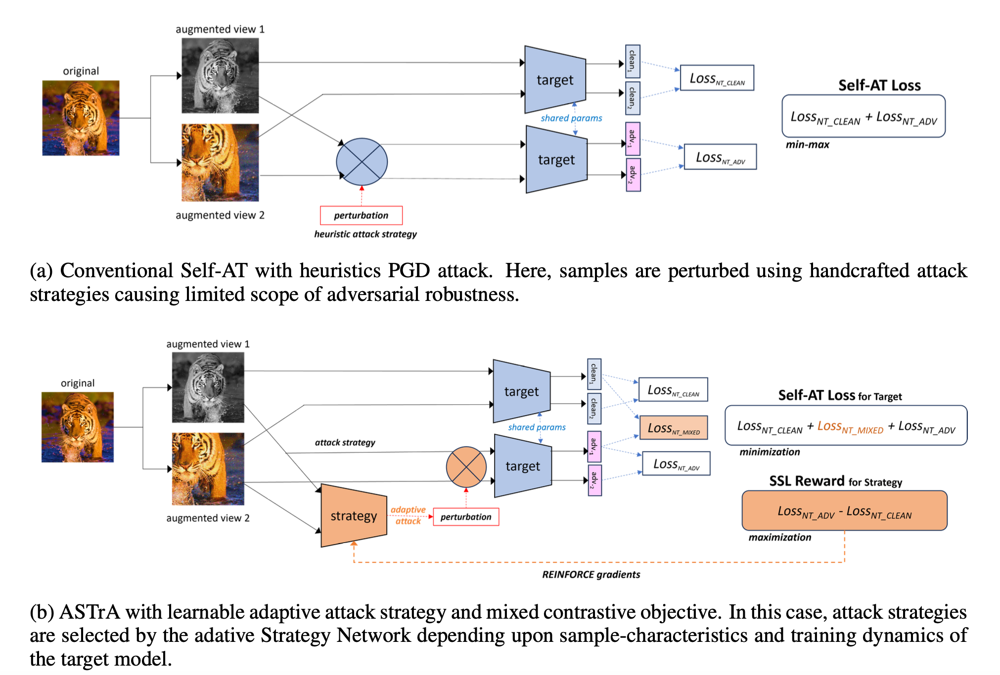

# ASTrA---Adversarial-Self-Supervised-Training-with-Adaptive-Attacks
This repo contains the work our ICLR submission 2024 titled "ASTRA: ADVERSARIAL SELF-SUPERVISED TRAINING WITH ADAPTIVE-ATTACKS"

Install the requisite conda environment using ASTra_environment.yml
To run the code:
Run it using the bash file
bash run.sh 

